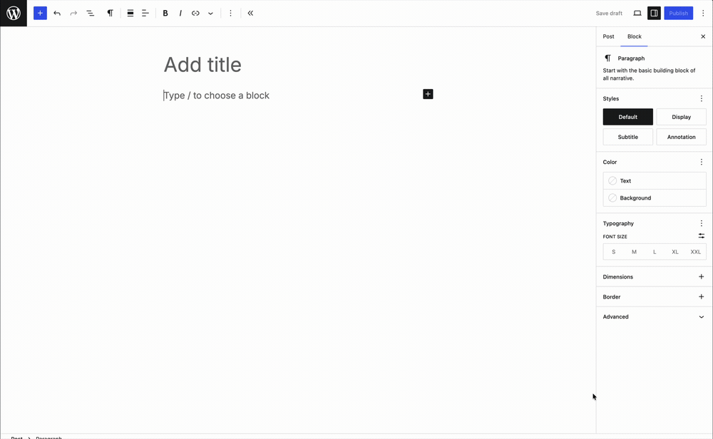

# Galeria mutelife — Gutenberg block

Automatically generate beautiful galleries with Gutenberg blocks! As seen on [mutelife.com](https://mutelife.com/).

Every image in a row is presented at the same height regardless of its aspect ratio, so mixed portrait/landscape sets line up cleanly without cropping.

---

## Supported galleries

**Auto** (default, any number of images)

Each image is given a `flex-grow` proportional to its aspect ratio and an explicit `aspect-ratio`, so a row keeps true proportions at any viewport width — and reserves its space before the images load.


**Fortico** (exactly 4 images)

One tall image on the left, three stacked on the right. Enabled automatically the first time you insert a 4-image gallery, and toggleable afterwards under **Layout** in the block sidebar.


## How to use

- Add the **mutelife Galeria** block to a post, page, or CPT.
- Select the images you want on each row.
- Use **Edit gallery** in the block toolbar to change the selection later.
- With exactly 4 images, toggle **Fortico** in the sidebar.



Galleries default to `wide` alignment; `full` is also supported.

## Requirements

- WordPress 6.8+
- PHP 7.4+

## Installation

Download [3.0.0.zip](https://github.com/keoshi/mutelife-galeria/archive/refs/tags/3.0.0.zip) — or any version from [Releases](https://github.com/keoshi/mutelife-galeria/releases) — and upload it through **Plugins → Add New → Upload Plugin**.

That archive unpacks to a folder named `mutelife-galeria-3.0.0`, so rename it to `mutelife-galeria` before installing. Otherwise each version installs alongside the previous one instead of replacing it, and two copies registering the same block will conflict.

To build from source instead:

```sh
npm install
npm run build
npm run plugin-zip
```

## Development

```sh
npm start        # watch + rebuild
npm run build    # production build
npm run lint:js  # lint
npm run format   # format
```

The block lives in `src/mutelife-galeria/`. `build/` is committed so the plugin can be installed straight from a checkout.

## Upgrading from 2.x

3.0.0 is a rewrite on `@wordpress/scripts`, replacing the `cgb-scripts` plugin in place. The block name is unchanged, so it takes over existing galleries rather than orphaning them.

- Existing posts keep rendering exactly as before — `style.scss` carries the legacy selectors alongside the new ones.
- `deprecated.js` recognises the 2.x saved markup, so old galleries open without validation errors and migrate to the new markup **when the post is next saved**. Untouched posts are never rewritten.
- Migrated images carry ratio-derived dimensions (`width: round(ratio × 1000)`, `height: 1000`) rather than their true pixel sizes. Only the ratio is used for layout.
- The legacy `unveil` class is dropped in favour of native `loading="lazy"`.

Note that 2.x registered the block without an `apiVersion`, which forced the editor out of its iframe and disabled iframe-dependent features (zoom out, accurate device previews) on any post containing a gallery. 3.0.0 declares `apiVersion: 3` and restores them.

## Credits

Props to [Jorge Costa](https://github.com/jorgefilipecosta) and [Jon Surrell](https://github.com/sirreal) for all the help and pointers!
